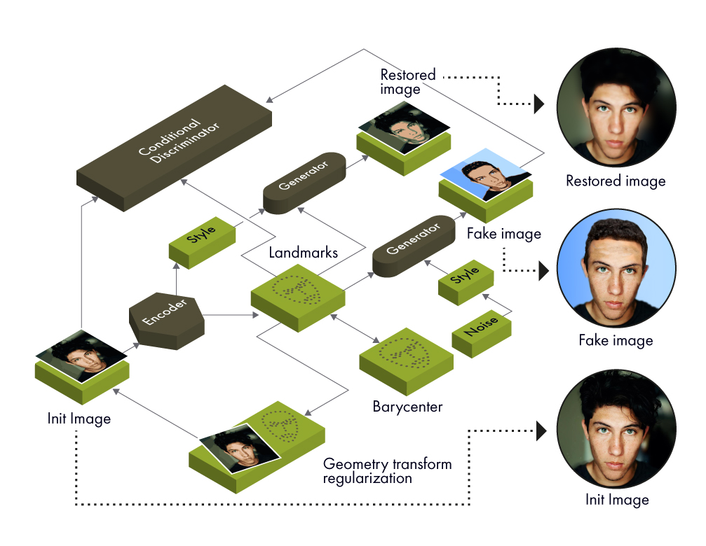

# BRULE

Implementation of Barycenter-Regularized Unsupervised Landmark Extraction in PyTorch

## Main requirements

* PyTorch 1.5.0
* CUDA 10.0+
* GPU 16Gb

## Principal diagram of the model

## Usage

Download datasets CelebA (http://mmlab.ie.cuhk.edu.hk/projects/CelebA.html) and 300-W (https://ibug.doc.ic.ac.uk/resources/300-W). Set the required paths to the datasets in file ./parameters/path.py.

- DefaultPath.ausland - path to the dataset.
- DefaultPath.homa - path to tensorboard logs folder.
- output model will be saved in path: "DefaultPath.ausland + "/saved_models"".

Compile cuda extensions of stylegan2:

> python3 ./gans_pytorch/gan/nn/stylegan/op/setup.py install

Start tensorboard:

> tensorboard --logdir=runs

- runs (path in DefaultPath.homa), like "/home/brule_logs/"

Train BRULE model with accuracy test on 300-W:

> python 3 ./examples/stylegan_train_unsupervised.py

components:

1. main:
- Create BRULE model.
2. Train part:
- Initialize g_transforms (transforms for geometric regularizer R_t), calculate barycenter.
- Create R_t (geom. reg.), R_b (barycenter reg.) regularizers.
- Train part before gan, after that train part with gan.
3. Logger.
- Send losses, metrics and pictures to tensorboard.

Contributors: n.buzun@skoltech.ru and iaroslav.bespalov@skoltech.ru
